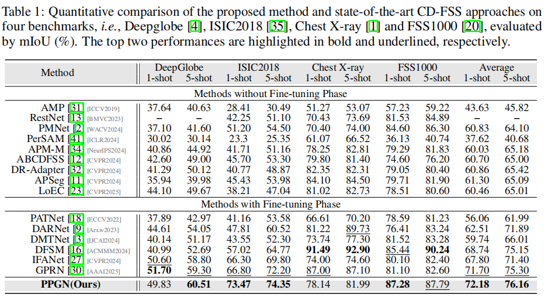

# Probabilistic Prototype Generation Network for Cross-Domain Few-Shot Segmentation

#### This is the official implementation of our paper "Probabilistic Prototype Generation Network for Cross-Domain Few-Shot Segmentation", which is submitted to NeurIPS2025.
 

# Dataset

#### The following datasets are used for evaluation in CD-FSS:

## Source domain:
  PASCAL VOC2012: Download PASCAL VOC2012 devkit (train/val data):  
  
    wget http://host.robots.ox.ac.uk/pascal/VOC/voc2012/VOCtrainval_11-May-2012.tar

  Download PASCAL VOC2012 SDS extended mask annotations from [Gooogle](https://drive.google.com/file/d/10zxG2VExoEZUeyQl_uXga2OWHjGeZaf2/view).

## Target domain:
  Deepglobe:
  
  Home: http://deepglobe.org/
  
  Direct: https://www.kaggle.com/datasets/balraj98/deepglobe-land-cover-classification-dataset
  
  Refer to [PATNet](https://github.com/slei109/PATNet), please preprocess the downloaded data (data/deepglobe_preprocess.py):

    python deepglobe_preprocess.py 

  ISIC2018:

  Home: http://challenge2018.isic-archive.com

  Direct (must login): https://challenge.isic-archive.com/data#2018

  Class Information: data/isic/class_id.csv

  Refer to [PATNet](https://github.com/slei109/PATNet), please preprocess the downloaded data (data/isic_preprocess.py):

    python isic_preprocess.py

  Chest X-ray:

  Home: https://www.ncbi.nlm.nih.gov/pmc/articles/PMC4256233/

  Direct: https://www.kaggle.com/datasets/nikhilpandey360/chest-xray-masks-and-labels

  FSS-1000:
  
  Home: https://github.com/HKUSTCV/FSS-1000
  
  Direct: https://drive.google.com/file/d/16TgqOeI_0P41Eh3jWQlxlRXG9KIqtMgI/view

## Dataset File Organization

    Dataset/                                        # dataset
    ├── VOC2012/                                    # source dataset: pascal voc 2012
    |   ├── JPEGImages/
    |   └── SegmentationClassAug/
    ├── Deeoglobe                                   # target dataset: deepglobe
    |   ├── image/                                  # image
    |   └── filter_mask/                            # mask
    |       ├── 1/                                  # category
    |       ├── ...                                 
    |       ├── 6/
    |       ├── 1.txt                               # image name
    |       ├── ...  
    |       └── 6.txt    
    ├── ISIC/                                       # target dataset: isic
    |   ├── ISIC2018_Task1-2_Training_Input/        # image
    |   |   ├── 1/                                  # category
    |   |   ├── 2/
    |   |   └── 3/
    |   └── ISIC2018_Task1_Training_GroundTruth/    # mask
    |       └── ...
    ├── LungSegmentation/                           # target dataset: chest x-ray
    |   ├── CXR_png/                                # image
    |   └── masks/                                  # mask
    └── FSS-1000                                    # target dataset: fss-1000
        ├── ab_wheel/                               # category
        └── ...

# Pre-trained ResNet Models

Download pre-trained models: [ResNet-50](https://pan.baidu.com/s/1B6wmULpEGH31c7EMQHlyQg?pwd=va88)[va88] and [DINOv2-base](https://pan.baidu.com/s/1YDS2kF8RF7KM8YX6EUZCnw?pwd=x549)[x549]

Download our trained models: [Chest X-ray](https://pan.baidu.com/s/1oAP9cAdZVXyIk-LBZgGbhQ?pwd=qvxy)[qvxy], [Deepglobe](https://pan.baidu.com/s/1wTPA2Jmnp1Rw-3yJDczO-w?pwd=jmyy)[jmyy], 
[FSS-1000](https://pan.baidu.com/s/1F8BzNh-k9DpVDRnBUZQiVQ?pwd=gi2k)[gi2k] and [ISIC2018](https://pan.baidu.com/s/1XytMXODXF1-s5wlwl3jlOA?pwd=wkst)[wkst].

# Test
Download the weights of pre-trained and our MPMN, and put them in the corresponding folder. Then you can run:

    test.py

# Performance and Visualisation
 

 

